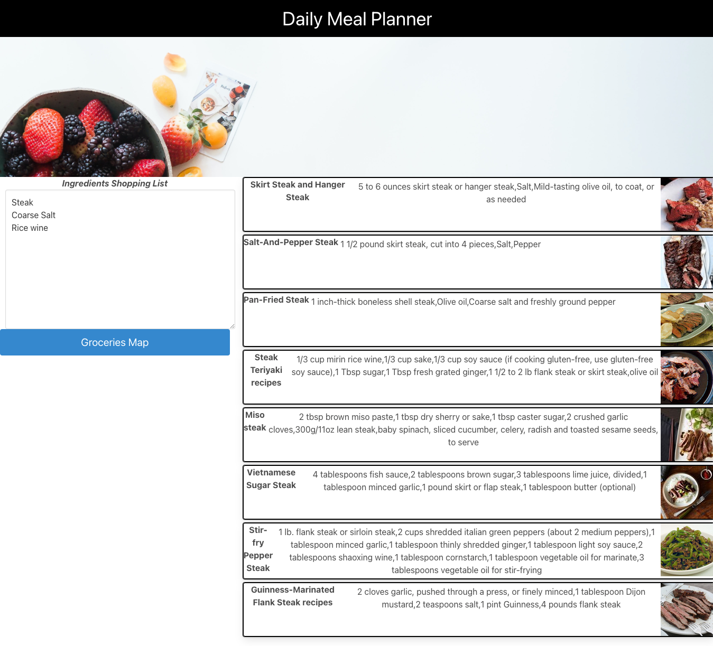

# daily-meal-planner

## Description

A web application used to generate recipes for the user based on their inputs which are meal type, a protein type, and amount of calories. The user can then add their ingredients into a list and then find a grocery store close to their address. This project was the first collaborative project I had taken part in and learned a lot about merge conflicts in github.

## Table of Contents

The below is the table of contents

- [Installation](#installation)
- [Usage](#usage)
- [Credits](#credits)

## Installation

Using CSS frameworks downloaded from the Bulma we connected the CDN to our index file to build an index.html, we then added 2 other html files for our recipe page generator and mapquest API. This was built in a team via github .

## Usage

Below is a screen shot of the application in use.

## Credits

Below are the people who I collaborated with to complete this project:

Dominick Albano |https://github.com/dev-dominick  
Mike Fedele |https://github.com/Mikefedele  
Owen Foreman | https://github.com/owenforeman1
